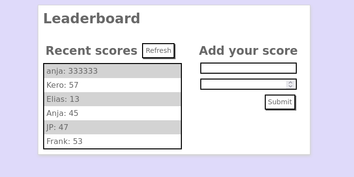

# Leaderboard API

A JavaScript project for the Leaderboard API implementation, using Webpack and ES6 features

## Demo
Get the live link [here](https://fabianofrank.github.io/leaderboard/)

## Built With

- JavaScript
- HTML and CSS
- GIT
- Webpack
- API

### Prerequisites
Git
Node.js

### Setup Git

Linux: [Instructions](https://git-scm.com/book/en/v2/Getting-Started-Installing-Git)

Windows: [Instructions](https://git-for-windows.github.io)

Mac: [Instruction](https://sourceforge.net/projects/git-osx-installer/files/)

### Setup Node.js

Linux: [Instructions](https://nodejs.org/en/download/package-manager/#debian-and-ubuntu-based-linux-distributions)

Windows: [Instructions](https://nodejs.org/en/download/package-manager/#windows)

Mac: [Instruction](https://nodejs.org/en/download/package-manager/#macos)

## Authors

👤 **Author**

- GitHub: [@fabianofrank](https://github.com/fabianofrank)
- Twitter: [@fabianofrankk](https://twitter.com/fabianofrankk)
- LinkedIn: [fabianofrank](https://linkedin.com/in/fabianofrank)

## 🤝 Contributing

Contributions, issues, and feature requests are welcome!

Feel free to check the [issues page](../../issues/).

## Show your support

Give a ⭐️ if you like this project!
